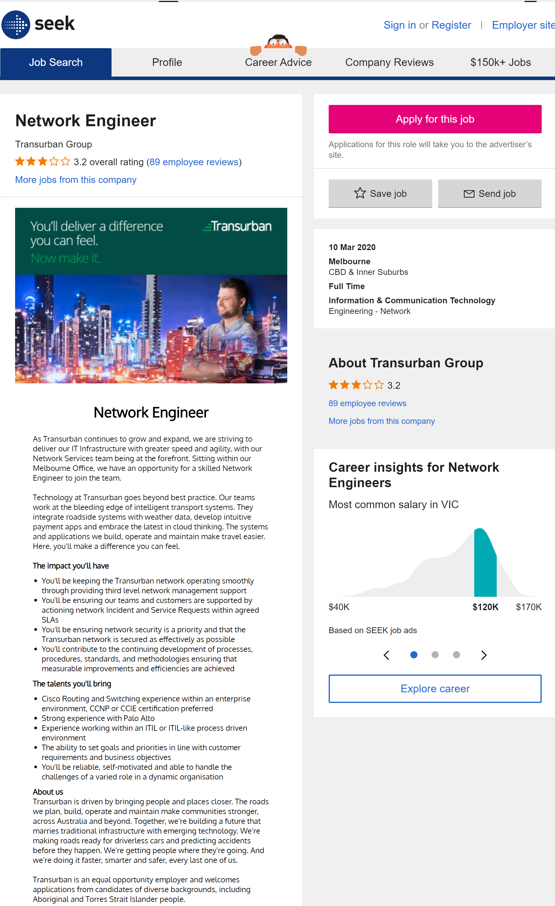

<html>
<body>

<h1 style="text-align:center;">COSC2196 Assignment 01</h1>

<h3>Personal Information</h3>

<b>Name:</b> Darren Miral 
<b>Student Number:</b> s3858795 
<b>email:</b> darren.miral@gmail.com or s3858795@student.rmit.edu.au 
<b>Background Information:</b> I was born and raised in Melbourne, Australia to Sri Lankan immigrants.  While I have never lived outside of Melbourne, I have travelled to a number of countries including the US, Canada, the UK and a number of countries in Central Europe. 
 
I completed in High School 2006 and completed a Bachelors Degree from Monash University in 2012.  I stopped working in my previous career after feeling a burnt out, tired of dealing with large numbers of strangers every day and unsure if it was the career I wanted. 
 
I have an intellectual curiosity regarding a number of subjects such as history, astronomy, chemistry and fine art and love quiz shows.  The National Football League (the major professional American football league) is also a significant interest of mine, and it is quite common for me to be awake before dawn on Monday mornings during the season to watch my team play.

<h3> Interest in IT</h3>

<h4>What is your interest in IT?</h4>

My interest in IT stems from an interest in video games and enjoying researching various computers and computer components.  I also enjoy occasionally troubleshooting issues as they arise, both in the context of IT and elsewhere.  My interest in video games began when I was in primary school and learnt how to use a GameBoy emulator on my PC to play Pokemon, which was quite exciting as I didn’t have a GameBoy myself, and continued through various strategy games such as WarCraft 2, Age of Empires and Starcraft during my teenage years.  I have also developed a bit of an interesting in computer programming through downloading and occasionally minorly manipulating mods of games in recent years.  Beyond building my own PC, servicing various laptop computers I’ve owned through school and university and setting up a NAS to store multimedia files, I have very little IT experience.

<h4> Why did you choose to come to RMIT?</h4>

I chose RMIT for both intellectual and practical reasons.  The intellectual reasons were two-fold.  The reputation of the university as one of the better ones in the country, and one of the top ones in the state was the first.  The second was due to reading from past students that RMIT provides more practical teaching than some other institutions and has a positive reputation within industry, which should theoretically help with finding employment in the future.  The practical reason for studying at RMIT was that I live in Melbourne, which is obviously where RMIT is based.

<h4>What do you expect to learn during your studies?</h4>

Learning programming skills, the installation and management of IT networks and equipment and potentially learning about cyber security were the major areas I hoped to learn from my time at RMIT.  I also expected that there would be some software and website development to be learnt in this course.

<h3>Ideal Job</h3>

As someone with no formal experience in the IT industry, the job description for a Network Engineer (Network Engineer job description and duties | Robert Half, 2020) sounds appealing.  Designing, installing and configuring network equipment sounds like a good mix of hands-on work while also requiring significant thought and planning, things I believe to be my strengths.  I enjoy problem solving, and this appears to also be a significant aspect of the job. 
 
This job advertisement I’ve chosen <a href="https://www.seek.com.au/job/41134226">is the following:</a>  
 

 

In order to be qualified for a similar job to this, I believe it will require 5+ years of learning and on the job experience, beginning with this course. 
 
The Bachelor of IT offered by RMIT through Open Universities Australia requires four electives to be completed.  After examining the Degree Guide, I believe that the following electives would probably be the most relevant in furthering me towards this career: Unix System Administration (CPT264); Programming Principles 2A (CPT 220); Object-Oriented Programming in C++ (CPT323); and Cloud Computing (CPT350). 
 
Beyond this degree, it is clear that further certification is required (How to Become a Network Engineer, 2020) beginning with CCNA (Cisco Certified Network Associate) or similar such as JNCIA – Junos which I believe to be a similar certification using competing equipment.  Other certifications such as the Microsoft Certified Solutions Associate (MCSA) certification in Windows Server 2016 and IT Infrastructure Library (ITIL) certifications could also be of use, while this job in particular would also require the Palo Alto Networks Certified Cybersecurity Associate (PCCSA) certification at a minimum – or more likely the more advanced Palo Alto Networks Certified Network Security Administrator (PCNSA) certification.  
 
As I have none of these qualifications or certifications, they would be completed either just before or during working as a network administrator to gain experience before being seen as qualified to be hired as a Network Engineer./p>

<h3>Personal Profile</h3>

<h4>Myers-Briggs Type Indicator (MBTI) test</h4>

<b>INTJ</b> (Introvert 81%; Intuitive 6%; Thinking 41%; Judging 28%;)

<h4>Learning Style test (VARK)</h4>

Multimodal (VARK) (Visual 10, Aural 4, Read/Write 8; Kinesthetic 12)

<h4>Big 5 Personality test</h4>

<body>

<table id="t01">
  <tr>
    <th>Trait</th>
    <th>Sub-traits</th> 
  </tr>
  <tr>
    <td>Extraversion <b>23</b></td>
    <td>Sociability 0  Assertiveness 62  Energy Level 5</td>
  </tr>
  <tr>
    <td>Agreeableness <b>52</b></td>
    <td>Compassion 62 Respectfullness 50 Trust 44</td>
  </tr>
  <tr>
    <td>Conscientiousness <b>50</b></td>
    <td>Organisation 38 Productiveness 31 Responsibility 81</td>
  </tr>
  <tr>
    <td>Negative Emotionality <b>29</b></td>
    <td></td>
  </tr>
  <tr>
    <td>Openmindedness <b>52</b></td>
    <td>Intellectual Curiosity 69 Aesthetic Sensitivity 38 Creative Imagination 12</td>
  </tr>
</table>

These test results engender mixed feelings.  I believe that elements of the MBTI do accurately reflect my personality, particularly those close to the ends of the spectrums of each individual dichotomy such as Introversion (as opposed to Extroversion) and Thinking (as opposed to feeling).  It is also consistent with a formal MBTI test I took in the final year of high school.  However, the MBTI is not a validated psychological test and is not based on any empirical evidence (Stromberg and Caswell, 2020), which should limit its usefulness.  Despite this, I am also aware that it is fairly commonly in hiring within certain industries.  The Big 5 Personality test is one that is scientifically valid, and therefore holds more weight.  It is interesting that despite the MBTI not being validated, in my case the two tests do appear to provide similar results.  
 
Learning Styles tests are another commonly used psychological test outside of academic psychology that is of questionable utility (Willingham, Hughes and Dobolyi, 2015).  Given the vague result I obtained from the VARK test, I believe that it would be of limited value to me, both during this course and in the workplace. 
 
Regardless of the validity of the tests, given my fairly introverted nature it is still important for me to understand my personality and how it may be perceived by others, particular in a team.  It is likely that I will have to endeavour to actively communicate to match that of other members of the team and to be more organised.  More broadly, when forming a team, it can be beneficial to ensure that the entire team is not made up of similar personalities as long as they are able to communicate effectively.  A varied group of personalities may lead to more broad ideas and could prevent one-track thinking, while also containing people that will delve into the details as required.  Being aware of the various personality traits, particularly those defined by the Big 5, can also lead to improved team harmony and a more enjoyable and productive experience. 

<h3>Project Idea</h3>

<h4>Overview</h4>

I propose to build a Raspberry Pi powered remote garage door opener, programmed it using Python, that feeds the open/shut status of the door to a dedicated website from where the door can be controlled.

<h4>Motivation</h4>

As someone with zero programming experience, I believe using this project as a means to learn the basics of another programming language would be beneficial.   
 After doing some reading about the Raspberry Pi and the fact that it uses Python, I decided to try learn enough Python to program a Raspberry Pi to do as proposed.  My motivation behind this is that I frequently leave the door open for hours unintentionally, and believe that an internet-controlled garage door would solve this issue.  As most “off the shelf” solutions are either expensive, are connected to digital assistants (which I do not use) or require other home automation equipment, I believe this to be a good solution.

<h4>Description</h4>

Garage door opening mechanisms work by completing a circuit which starts the motor used to wind the door up and down.  A Raspberry Pi will be connected via a relay switch so that the Raspberry Pi controlled switch becomes the component that controls the motor. 
 This Raspberry Pi will also be used to host a simple website that allows you to both view the status of the door and control it as necessary, from anywhere in the world.

<h4>Tools and Technologies</h4>

This project will require the following hardware: a Raspberry Pi; a relay; wiring; a magnetic switch (which will be used to determine if the door is open or closed) and ethernet cabling.  An IDE will be required for the programming and a text editor like Notepad++ while likely be required for the website. 

<h4>Skills Required</h4>

The major skill required for this project will be learning enough Python to write my own code to have the Raspberry Pi control the door and respond to inputs from the website made.  I will also need to learn enough HTML to create the website.  The required hardware will also need to be purchased, and although none of the components are particularly specialised the current global climate may make purchasing such items more difficult.  

<h4>Outcome</h4>

Successful completion of this project will result in both tangible and less tangible outcomes.  The tangible outcome will be a garage door that can be opened over the internet.  The less tangible outcomes will be my having learnt some Python and HTML skills.

 
<h3>References</h3>

Roberthalf.com.au. 2020. Network Engineer Job Description And Duties | Robert Half. [online] Available at: <https://www.roberthalf.com.au/employers/it-technology/network-engineer-jobs> [Accessed 16 March 2020]. 
 New Horizons Worldwide. 2020. How To Become A Network Engineer. [online] Available at: <https://www.newhorizons.com/article/how-to-become-a-network-engineer> [Accessed 16 March 2020]. 
 Stromberg, J. and Caswell, E., 2020. Why The Myers-Briggs Test Is Totally Meaningless. [online] Vox. Available at: <https://www.vox.com/2014/7/15/5881947/myers-briggs-personality-test-meaningless> [Accessed 17 March 2020].  
 Willingham, D., Hughes, E. and Dobolyi, D., 2015. The Scientific Status of Learning Styles Theories. Teaching of Psychology, 42(3), pp.266-271. 

</body>
